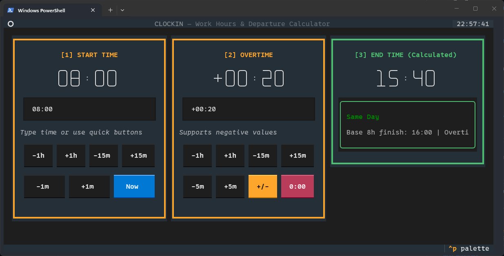

# clockin

Clockin is a TUI app that calculates when to clock out based on start time and overtime.

If you have overtime, set positive time. If you have undertime, set negative overtime.

---
> this app is shamelessly 100% vibecoded

